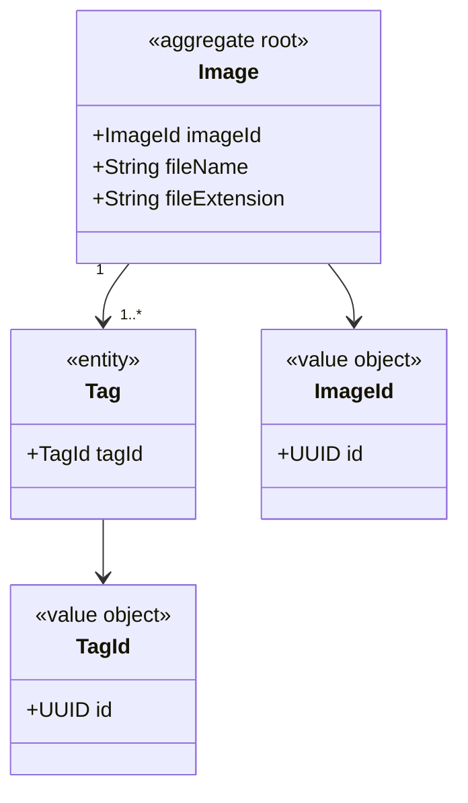

## DATA MODEL

### Image json example:
```json
{
    "id": "aaaaaaaa-bbbb-cccc-dddd-eeeeeeeeeeee",
    "fileName" : "image_1",
    "extension" : "jpg",
    "tags" : [
        {
            "id": "tag_1"
        },
        {
            "id": "tag_2"
        }
    ]
}
```

Add these model files:
https://gmqualitytechnologysl365-my.sharepoint.com/:f:/g/personal/coquedediego_digitechfp_com/IgA__NFeM6gCTJ-2u8Mvj2ZQARohUmfj-F1cUUyEUB9dvks?e=LSZYtc
into the backend/model package
