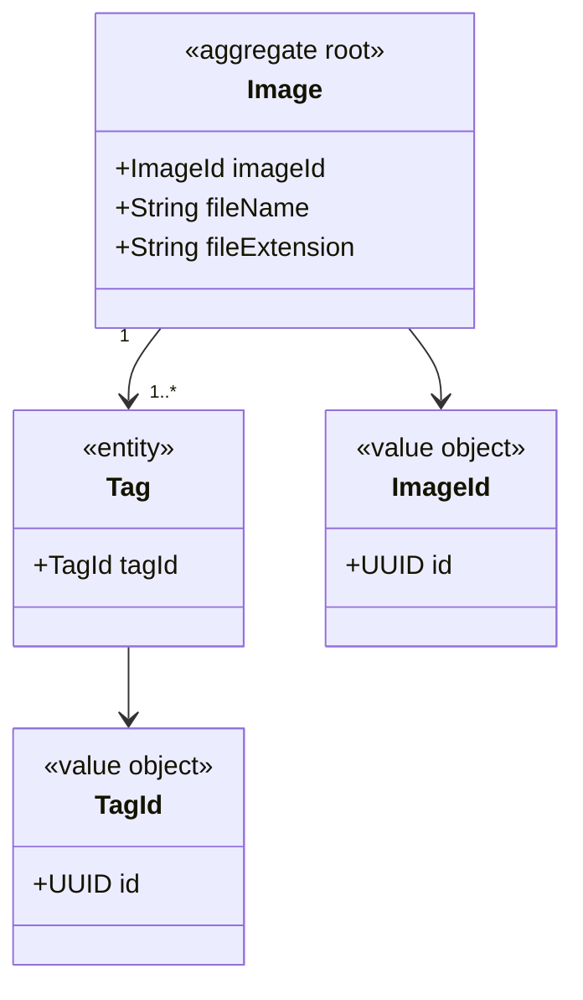

# Instrucciones de Instalación y Despliegue
Debido a que actualmente el modelo IA requiere invocarse a través de cmd.exe, debe
ejecutarse en local sobre Window. Los pasos para levantar el entorno completo son:
## REQUISITOS PREVIOS
• JDK 25 (o 21 si se ajusta java.version en pom.xml). Verificar con «java -version» y «javac
-version».
• Node.js ≥ 22 y npm ≥ 10. Verificar con «node -v» y «npm -v».
• Angular CLI: «npm install -g @angular/cli».
• Python 3.11 y DeepDanbooru clonado
• Modelo entrenado de DeepDanbooru .keras ubicado en Scryframe_backend/model/
(archivo disponible para descargar mediante enlace en el README)

## PASO 1 - CONFIGURACIÓN
Editar Scryframe_backend/src/main/resources/application.properties y ajustar las
rutas relativas si fuera necesario:
``scryframe.storage.path=./storage``
``scryframe.deepdanbooru.project-path=./model``
``spring.servlet.multipart.max-file-size=20MB``
``spring.servlet.multipart.max-request-size=20MB``

## PASO 2 - INSTALACIÓN DE DEEPDANBOORU
Para poder ejecutar los comandos de DeepDanbooru, se debe instalar primero.
Necesitarás tener específicamente una versión Python 3.11, una vez lo tengas clona el
repositorio de DeepDanbooru en local, accede por cmd a la carpeta, que debería contener
‘requirements.txt’ y ejecuta:
``py –3.11 -m pip install –r requirements.txt``
``py –3.11 -m pip install .[tensorflow]``

## PASO 3 - BASE DE DATOS
No requiere instalación. H2 se inicializa en memoria al arrancar Spring Boot y JPA crea
las tablas (images, tags, tagged_images) automáticamente a partir de las anotaciones de
las entidades. Para entornos con persistencia entre arranques bastaría con cambiar la
URL JDBC a modo fichero (jdbc:h2:file:./data/scryframe).

## PASO 4 - ARRANCAR EL BACKEND
``cd Scryframe_backend``
``.\mvnw.cmd clean spring-boot:run``
El servidor queda escuchando en http://localhost:8080.

## PASO 5 - ARRANCAR EL FRONTEND
En otra terminal:
``cd Scryframe_frontend``
``npm install`` (solo la primera vez)
``npm start``
Angular CLI sirve la SPA en http://localhost:4200 con recarga en caliente.

## PASO 6 - USO
Abrir el navegador en http://localhost:4200. La ruta raíz redirige a /upload, donde se
puede subir una imagen, revisar las etiquetas predichas por DeepDanbooru y guardarla.
Una vez guardada, en /gallery se puede consultar el catálogo y filtrar por etiquetas
usando los chips de búsqueda.

# DATA MODEL

### Image json example:
```json
{
    "id": "aaaaaaaa-bbbb-cccc-dddd-eeeeeeeeeeee",
    "fileName" : "image_1",
    "extension" : "jpg",
    "tags" : [
        {
            "id": "tag_1"
        },
        {
            "id": "tag_2"
        }
    ]
}
```

Add these model files:
https://gmqualitytechnologysl365-my.sharepoint.com/:f:/g/personal/coquedediego_digitechfp_com/IgA__NFeM6gCTJ-2u8Mvj2ZQARohUmfj-F1cUUyEUB9dvks?e=LSZYtc
into the backend/model package
